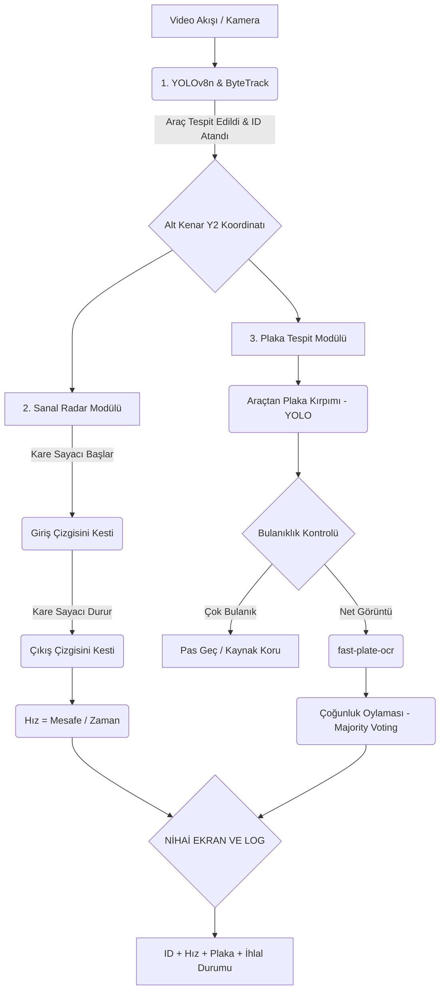

# 🚗 AI-Based Vehicle Speed & Plate Detection System

Bu proje, tek bir sabit güvenlik kamerası açısından geçen araçların anlık hızlarını ve plakalarını yüksek doğrulukla tespit etmeyi amaçlayan, görüntü işleme ve derin öğrenme tabanlı bir sistemdir. Klasik donanımsal radar cihazlarına ihtiyaç duymadan, video analitiği ve "Sanal Radar (Virtual Loop)" mantığı kullanarak çalışır.

## 🌟 Özellikler

* **Donanımsız Hız Ölçümü:** Sadece kamera görüntüsü üzerinden, pikselleri gerçek dünya metriklerine çevirerek hız ölçümü.
* **Sanal Radar (Virtual Loop):** Titreşimli ve hatalı anlık ölçümler yerine, giriş-çıkış çizgileri arasında makro zaman/mesafe hesabı ile %2-%5 hata payı.
* **Akıllı Referans Noktası:** Perspektiften kaynaklı esnemeleri önlemek için araçların "Kutu Merkezi" yerine "Yere Temas Noktası (Alt Kenar)" referans alınır.
* **Bulanıklık Kontrolü (Motion Blur Check):** Hareket bulanıklığına sahip plakalar, Laplacian varyansı ile tespit edilip elenerek sistem kaynakları (CPU/GPU) korunur.
* **Majority Voting (Çoğunluk Oylaması):** Plaka okunurken anlık hataları sıfırlamak için araç kadrajdayken alınan tüm OCR sonuçları harf bazlı oylanarak en doğru nihai plaka oluşturulur.
* **Hız İhlal Bildirimi:** Belirlenen limiti (Örn: 50 km/h) aşan araçlar ekranda ve terminal loglarında otomatik olarak vurgulanır.

---

## 🛠️ Teknoloji Yığını (Tech Stack)

* **Dil:** Python 3.x
* **Araç Tespiti (Object Detection):** YOLOv8n (Performans için Nano model)
* **Nesne Takibi (Tracking):** ByteTrack (Kesintisiz Track ID ataması için)
* **Plaka Tespiti:** YOLOv8n (Plaka tespiti için özel eğitilmiş custom model)
* **OCR Modeli:** `fast-plate-ocr` (CCT-S-v2 Global Model)
* **Görüntü İşleme ve Matematik:** OpenCV, NumPy

---

## 📂 Veri Seti (Dataset)

Bu projenin geliştirilmesi ve test edilmesi aşamasında, açık kaynaklı **VS13 (Vehicle Speed 13)** veri setinden yararlanılmıştır.

* **Kaynak:** [Slobodan - VS13 Dataset](https://slobodan.ucg.ac.me/science/vs13/)
* **Kullanılan Alt Küme:** Sistemin kalibrasyonunu ve testlerini standartlaştırmak amacıyla, veri setindeki yalnızca **Peugeot 3008** model araçların farklı hız senaryolarını (40 km/h - 100 km/h arası) içeren videolar izole edilerek kullanılmıştır.

---

## ⚙️ Sistem Mimarisi ve İş Akışı

Sistemin modüler yapısı üç temel aşamadan oluşmaktadır: Tespit/Takip, Hız Ölçümü ve OCR.



---

## 🚀 Kurulum ve Kullanım

**1. Gerekli kütüphaneleri yükleyin:**
Sistemin çalışması için gerekli kütüphaneleri (YOLO, OpenCV, fast-plate-ocr vb.) kurun.

```bash
pip install -r requirements.txt

```

**2. Sistemi tek bir videoda (Görsel Arayüz ile) çalıştırın:**

```bash
python car_detect_virtual_loop.py videos/Peugeot3008_70.MP4

```

**3. Başarımı test etmek için tüm videoları (Arka planda) çalıştırın:**

```bash
python batch_evaluate.py --headless

```

---

## 📊 Test Sonuçları ve Başarı Oranları

Proje, Peugeot 3008 araçlarının yer aldığı 30'dan fazla farklı hız senaryosuna sahip video veri seti üzerinde test edilmiştir:

* **Hız Ölçüm Doğruluğu:** Araçların büyük bir çoğunluğunda **%2 ila %5** gibi endüstri standartlarında hata paylarıyla ölçüm yapılmıştır.
* **OCR Başarısı:** Çoğunluk oylaması algoritması sayesinde okunabilir plakaların %100'e yakını kusursuz çıkarılmıştır.

### ⚠️ Sınır Durumlar (Edge Cases) ve Donanım Kısıtları

İstisnai birkaç videoda görülen sapmalar matematiksel bir hatadan ziyade **kameranın FPS (Saniyedeki Kare Sayısı) limitinden** kaynaklanmaktadır.
Sistem 30 FPS videolar üzerinde çalışmaktadır. (1 kare = ~33ms). 100 km/s hızla giden bir araç iki kare arasında yaklaşık 1 metre mesafe kat eder. YOLO'nun araç üzerindeki far/yansıma parlamaları nedeniyle sınır kutusunu (Bounding Box) anlık esnetmesi, bu milisaniyelik sanal çizgi geçiş zamanlamasını etkileyebilmektedir. Gelecek çalışmalarda **60 veya 120 FPS** kameralar kullanılarak bu donanımsal sapma sıfıra indirilebilir.

---
