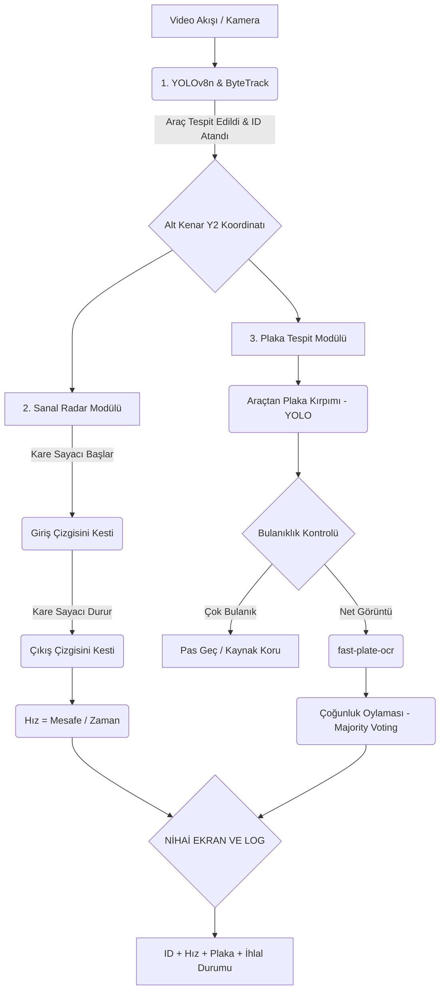

#  AI-Based Vehicle Speed & Plate Detection System

Bu proje, tek bir sabit güvenlik kamerası açısından geçen araçların anlık hızlarını ve plakalarını yüksek doğrulukla tespit etmeyi amaçlayan, yapay zeka ve görüntü işleme tabanlı bir sistemdir. Klasik radar cihazlarına ihtiyaç duymadan, video analitiği ve **"Sanal Radar (Virtual Loop)"** mantığıyla çalışır.

## 🌟 Öne Çıkan Özellikler

* **Donanımsız Hız Ölçümü:** Sadece kamera görüntüsü üzerinden, önceden ölçülmüş sabit referans aralıklarını kullanarak %2-%5 hata payıyla hız tespiti.
* **Sanal Radar (Virtual Loop):** Titreşimli anlık ölçümler yerine, giriş-çıkış çizgileri arasında makro zaman/mesafe hesabı.
* **Bulanıklık Kontrolü & Çoğunluk Oylaması:** Hareket bulanıklığı olan plakalar elenir, net okunan plakalar harf bazlı oylanarak en doğru nihai sonuç (Majority Voting) elde edilir.
* **Hız İhlal Bildirimi:** Hız limitini aşan araçlar ekranda kırmızı uyarı ile vurgulanır.

---

## 🛠️ Teknoloji Yığını (Tech Stack)

* **Dil:** Python 3.x
* **Araç Tespiti (Object Detection):** YOLOv8 (Performans için Nano/Small modeller)
* **Nesne Takibi (Tracking):** ByteTrack (Kesintisiz Track ID ataması için)
* **OCR Modeli:** `fast-plate-ocr` (CCT-S-v2 Global Model)
* **Görüntü İşleme:** OpenCV, NumPy

---

## 📁 Proje Yapısı

GitHub deposunun modüler ve sade yapısı şu şekildedir:

```text
.
├── plate_detection/               # Plaka modeli eğitim ve test betikleri
│   ├── test_plate.py              # Eğitilmiş plaka modelini test etme dosyası
│   └── train_plate.py             # Plaka tespit modelini sıfırdan eğitme dosyası
├── .gitignore                     # Git tarafından yoksayılacak dosyalar
├── batch_evaluate.py              # Birden fazla videoyu toplu test etmek için betik
├── car_detect_virtual_loop.py     # ANA SCRIPT — Hız ve plaka tespitini yapan kod
├── README.md                      # Proje dokümantasyonu
└── requirements.txt               # Gerekli Python kütüphaneleri

```

---

## ⚙️ Sistem İş Akışı

1. **Tespit ve Takip:** YOLOv8 ile araç tespit edilir, ByteTrack ile araca eşsiz bir kimlik (ID) atanır.
2. **Hız Ölçümü:** Aracın alt kenarı (Y2 koordinatı - zemin teması) baz alınır. Araç sanal giriş ve çıkış çizgilerinden geçerken geçen süre kare (frame) bazlı ölçülür, `Hız = Mesafe / Zaman` formülüyle stabil makro hız bulunur.
3. **Plaka Okuma:** Araçtan plaka bölgesi kırpılır, bulanıklık kontrolünden (Laplacian) geçirilir ve netse OCR ile okunup kaydedilir.

---

## 🚀 Kurulum ve Kullanım

**1. Repoyu bilgisayarınıza klonlayın ve klasöre girin:**

```bash
git clone https://github.com/KULLANICI_ADINIZ/plate_and_speed_detection_system.git
cd plate_and_speed_detection_system

```

**2. Gerekli kütüphaneleri yükleyin:**

```bash
pip install -r requirements.txt

```

*(Not: Kendi eğittiğiniz plaka ağırlık dosyanızı `.pt` ve YOLO araç tespit modelinizi proje dizinine eklemeyi unutmayın).*

**3. Sistemi kendi videonuz üzerinde çalıştırın:**

```bash
python car_detect_virtual_loop.py sizin_videonuz.mp4

```

**4. Başarımı test etmek için toplu değerlendirme:**
Birden fazla test videonuz varsa, bunları bir klasöre toplayıp `batch_evaluate.py` içerisindeki dosya yollarını güncelleyerek arka arkaya (headless modda) çalıştırabilirsiniz:

```bash
python batch_evaluate.py

```

---

## 📊 Test Başarı Oranları

Geliştirme sürecinde 30'dan fazla farklı hız senaryosuna (40 km/h - 100 km/h) sahip otoyol veri setleri üzerinde yapılan testlerde sistemin elde ettiği sonuçlar:

* **Hız Ölçüm Doğruluğu:** Araçların büyük bir çoğunluğunda **%2 ila %5** gibi endüstri standartlarında hata paylarıyla ölçüm yapılmıştır.
* **OCR Başarısı:** Çoğunluk oylaması algoritması sayesinde okunabilir plakaların neredeyse tamamı doğru çıkarılmıştır.
* **Kısıtlamalar:** Sistem, çalıştırılan videonun FPS (Saniyedeki Kare Sayısı) değerine duyarlıdır. 30 FPS standart videolarda yüksek hızlara çıkıldığında (100+ km/h), kare atlamalarından kaynaklı ufak matematiksel sapmalar görülebilir; 60 FPS kameralar ile bu hata payı sıfıra yaklaşmaktadır.

## 📂 Veri Seti (Dataset)

Bu projenin geliştirilmesi ve test edilmesi aşamasında, açık kaynaklı **VS13 (Vehicle Speed 13)** veri setinden yararlanılmıştır.

* **Kaynak:** [Slobodan - VS13 Dataset](https://slobodan.ucg.ac.me/science/vs13/)
* **Kullanılan Alt Küme:** Sistemin kalibrasyonunu ve testlerini standartlaştırmak amacıyla, veri setindeki yalnızca **Peugeot 3008** model araçların farklı hız senaryolarını (40 km/h - 100 km/h arası) içeren videolar izole edilerek kullanılmıştır.

## ⚙️ Sistem Mimarisi ve İş Akışı

Sistemin modüler yapısı üç temel aşamadan oluşmaktadır: Tespit/Takip, Hız Ölçümü ve OCR.


